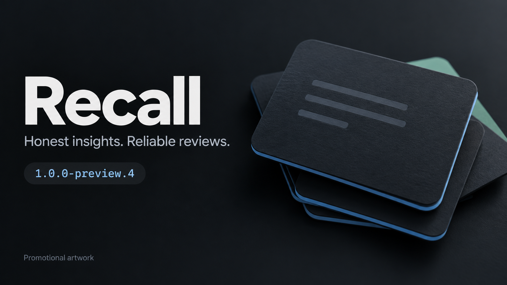
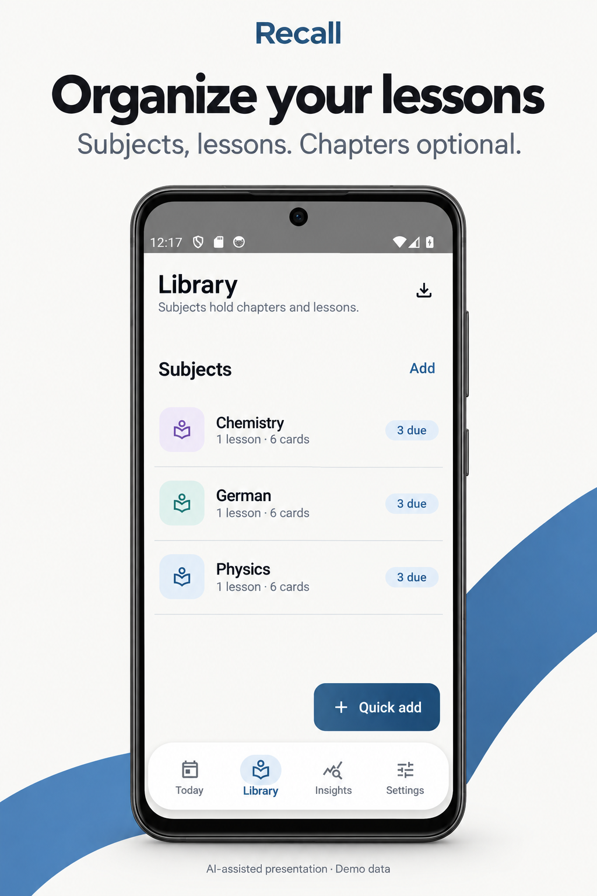
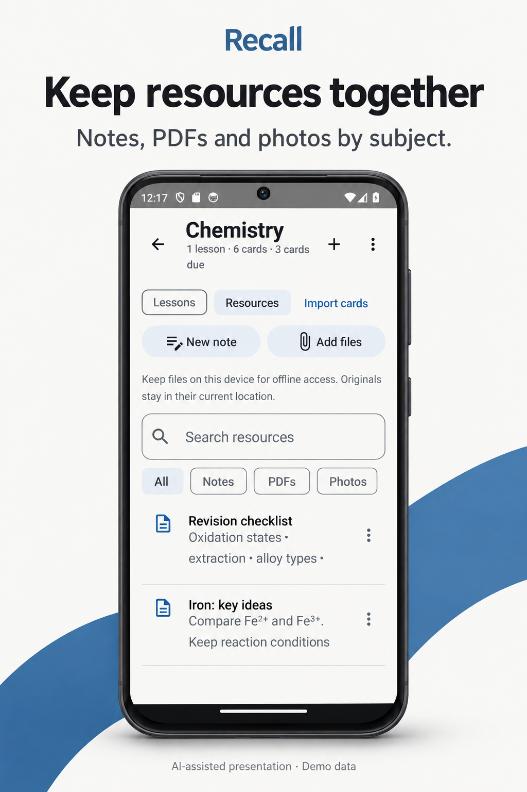
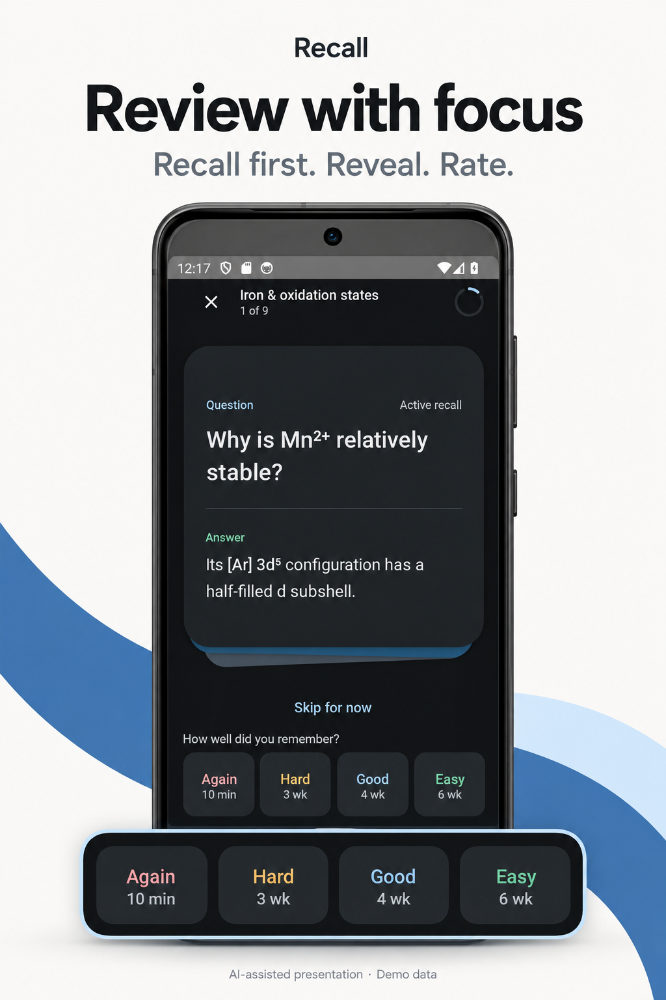
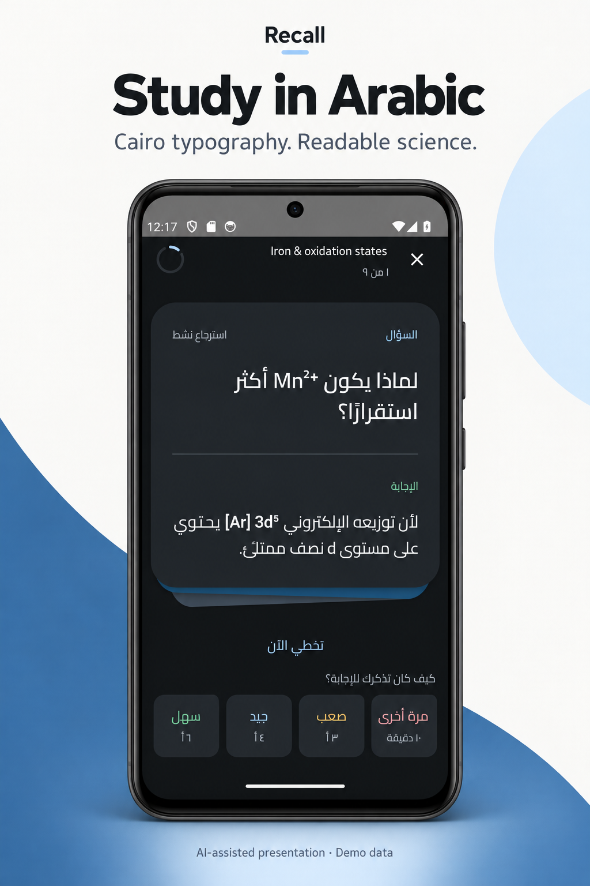
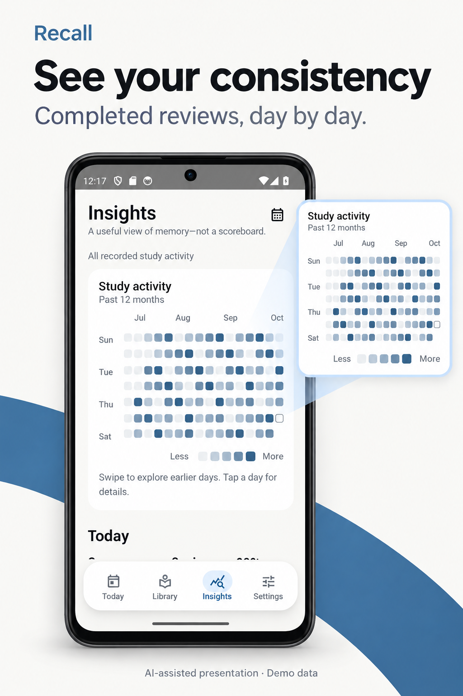
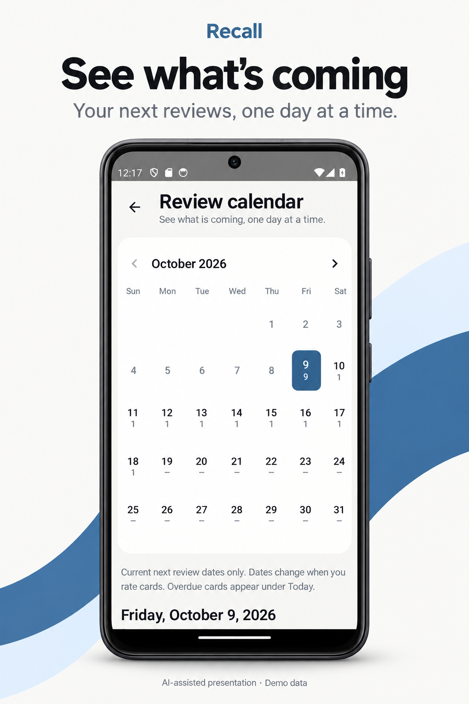

# Recall



*AI-generated promotional cover, not an app screenshot.*

Offline-first native Android study companion built around subjects, optional
chapters, and lessons. Flashcards help retain lessons over time rather than
acting as the primary organization system.

Download the [latest public preview](https://github.com/AbdulrahmanAhmedGit/Recall/releases/tag/v1.0.0-preview.4)
for Android 7.0 or newer. Preview APKs are debug-signed; export a full backup before
updating and read the release's installation notes.

## Built with Codex, supervised by the project owner

Recall's application implementation was developed **100% with AI using OpenAI
Codex, under the project owner's direction and supervision**. The project owner
defines the product, requests and evaluates changes, and gives final approval.
This credit describes Recall's own implementation, not the authorship of Android,
Jetpack, fonts, or other third-party dependencies, which retain their own licenses.

AI-assisted development does **not** mean the app requires an AI service to run.
Core studying works offline. AI card generation is an optional, external workflow:
copy Recall's prompt to your preferred AI, then validate and import its JSON.

## Explore the app

See the [complete feature guide](docs/features.md) for each feature, how to use it,
screenshots, and current limitations. See [latest changes](docs/CHANGELOG.md) for
the localization, calendar and reliability improvements included in this source version.

### Inside Recall

<table>
  <tr><th>Lesson-based library</th><th>Subject resources</th></tr>
  <tr>
    <td><a href="docs/screenshots/preview4/readme-preview4/library.png"></a></td>
    <td><a href="docs/screenshots/preview4/readme-preview4/resources.png"></a></td>
  </tr>
  <tr><th>Focused review</th><th>Arabic &amp; science</th></tr>
  <tr>
    <td><a href="docs/screenshots/preview4/readme-preview4/review.png"></a></td>
    <td><a href="docs/screenshots/preview4/readme-preview4/review-arabic.png"></a></td>
  </tr>
  <tr><th>Study activity</th><th>Review calendar</th></tr>
  <tr>
    <td><a href="docs/screenshots/preview4/readme-preview4/insights.png"></a></td>
    <td><a href="docs/screenshots/preview4/readme-preview4/calendar.png"></a></td>
  </tr>
</table>

These are **AI-assisted feature panels based on real Preview 4 Android captures**,
not proposed UI designs or untouched screenshots. AI rendering can slightly alter
small visual details; click a panel to inspect its unedited screenshot. All content
and review history are synthetic demonstration data; no personal library is shown.
Dates, counts and intervals are examples, not promises about your workload or retention.
The running app uses your actual data. See the [capture inventory](docs/screenshots/README.md)
and [presentation provenance and prompts](docs/images/inside-recall/README.md).

## Features

- Kotlin, Jetpack Compose, Material 3, Room, DataStore, and WorkManager.
- FSRS-6 review scheduling with rating previews and persisted review history.
- Manual cards, provider-independent AI JSON import, and science notation support.
- Subject resources for notes, PDFs, and photos; portable full-data backups.
- Quiet times, study windows, reminder pauses, and notification diagnostics.
- Review activity heatmap and Skip for now without changing card schedules.
- Review calendar in Today and Insights: current next due dates, daily counts and types, read-only card previews, and lesson links. Overdue cards remain under Today; suspended/archived content is excluded. Local midnight boundaries handle timezone/DST changes. No scheduling or database-schema change is required.
- Subtle short navigation/dock/calendar transitions, saved tab scroll positions, bounded calendar detail loading, and fresh due counts while the app is open.
- Offline English, Arabic, Spanish, French and German interfaces—not just layout direction—with localized settings, review controls, reminders, errors, plurals and dates. Study content and pronunciation languages stay independent of the interface.
- A localized guide explaining the study workflow and scientific foundations,
  shown once at startup and available again from Settings.
- Light/dark appearance and bidirectional educational text rendering.

## Build

Use Android Studio, JDK 17, and Android SDK 36. Configure your local SDK location
in `local.properties` (not committed).

```sh
./gradlew assembleDebug
./gradlew assemblePreview
./gradlew testDebugUnitTest lintDebug
./gradlew connectedDebugAndroidTest
```

The debug APK is generated under `app/build/outputs/apk/debug/`. Instrumented
tests require a connected emulator or device. The application name is defined
in Android string resources.

For everyday testing, `app/build/outputs/apk/preview/app-preview.apk` is an
optimized, resource-shrunk, non-debuggable build. It uses the local debug key
to update existing preview installations without uninstalling or resetting data.
It is not a store release: public/store releases require a managed release signing
key. Keep the debug build for instrumentation and debugging.

## Learning model

See [Phase 3 reliability, optional small sessions, measured performance and device
checklist](docs/phase3-reliability.md). New review dates are anchored coherently to
rating submission; existing history is preserved, not reconstructed.

Learning Insights reports [event-based observed recall, estimated memory maturity,
and optional attention suggestions](docs/learning-insights.md). It shows sample
sizes, excludes unreliable legacy audit records, and distinguishes memory estimates
from comprehension. Optional expandable current predicted recall reuses the FSRS-6
curve with explicit active-card coverage. [Historical prediction and calibration](docs/learning-insights-phase2-proposal.md)
remain deferred; no analytics migration or scheduling change is included.

Recall supports retrieval practice and spaced practice, with FSRS-6 memory-state
equations. Predictions are estimates, not guarantees of learning outcomes. This
implementation uses default FSRS weights rather than personalized parameter
training; Again includes a product-level 10-minute relearning step.

- [Retrieval practice research](https://pubmed.ncbi.nlm.nih.gov/26151629/)
- [Distributed practice research](https://pubmed.ncbi.nlm.nih.gov/16719566/)
- [FSRS algorithm documentation](https://github.com/open-spaced-repetition/awesome-fsrs/wiki/The-Algorithm)
- [Recall scheduler notes](docs/fsrs-scheduler.md)

## Privacy and limitations

Core study data is local and no account is required. External AI providers and
research links are optional and governed by their own policies. Android battery
restrictions and force-stop can delay notifications. Export a full backup to
preserve attached file contents; data-only JSON does not include them.

Build artifacts, machine-local configuration, validation captures, credentials,
and personal backups are excluded from this repository. The chemistry JSON in
`recall-imports/` is an educational regression fixture used by instrumented tests.
Third-party licenses and attribution are documented in
[THIRD_PARTY_NOTICES.md](THIRD_PARTY_NOTICES.md).

## Community

Contributions and reports in English or Arabic are welcome. Read the
[contribution guide](CONTRIBUTING.md), [code of conduct](CODE_OF_CONDUCT.md) and
[support guide](SUPPORT.md). Use the [issue forms](https://github.com/AbdulrahmanAhmedGit/Recall/issues/new/choose)
for bugs/features or [Discussions](https://github.com/AbdulrahmanAhmedGit/Recall/discussions)
for questions. Report vulnerabilities privately according to [SECURITY.md](SECURITY.md).

## License

Recall is licensed under the [MIT License](LICENSE). Third-party components retain
their own licenses and attribution; see [THIRD_PARTY_NOTICES.md](THIRD_PARTY_NOTICES.md).
