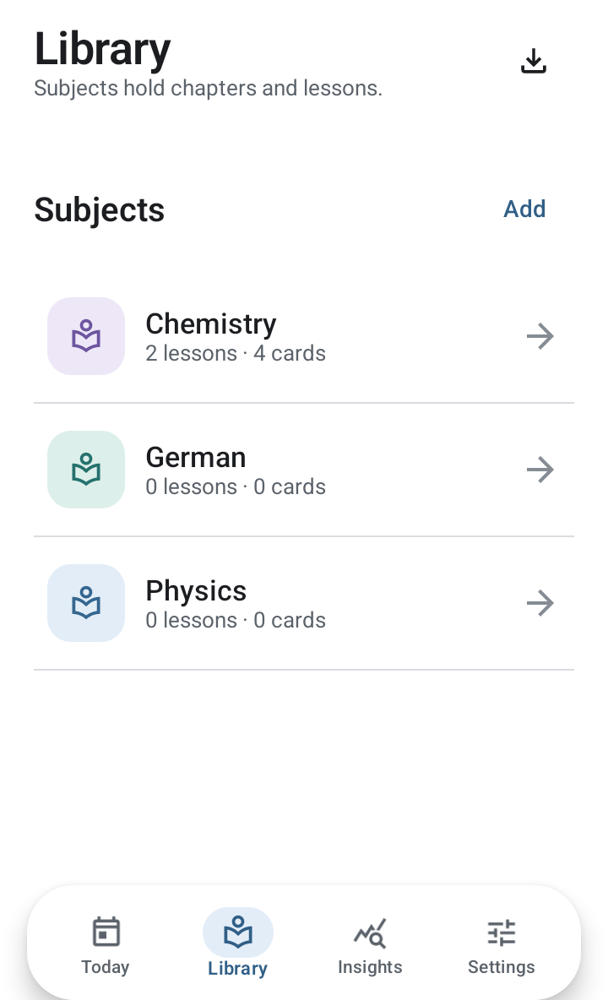

# Recall

Offline-first native Android study companion built around subjects, optional
chapters, and lessons. Flashcards help retain lessons over time rather than
acting as the primary organization system.

Download the [latest public preview](https://github.com/AbdulrahmanAhmedGit/Recall/releases/tag/v1.0.0-preview.2)
for Android 7.0 or newer. Preview APKs are debug-signed; export a full backup before
updating and read the release's installation notes.

## Built with Codex, supervised by the project owner

Recall's application implementation was developed **100% with AI using OpenAI
Codex, under the project owner's direction and supervision**. The project owner
defines the product, requests and evaluates changes, and gives final approval.
This credit describes Recall's own implementation, not the authorship of Android,
Jetpack, fonts, or other third-party dependencies, which retain their own licenses.

AI-assisted development does **not** mean the app requires an AI service to run.
Core studying works offline. AI card generation is an optional, external workflow:
copy Recall's prompt to your preferred AI, then validate and import its JSON.

## Explore the app

See the [complete feature guide](docs/features.md) for each feature, how to use it,
screenshots, and current limitations. See [latest changes](docs/CHANGELOG.md) for
the calendar and reliability improvements included in this source version.

<p>
  
  
  
</p>

These are native Android UI captures with demonstration content, not AI-generated
mockups or a user's private study history. Screenshot dates and counts are examples;
the running app uses your actual data. Capture details are in the
[screenshot inventory](docs/screenshots/README.md).

## Features

- Kotlin, Jetpack Compose, Material 3, Room, DataStore, and WorkManager.
- FSRS-6 review scheduling with rating previews and persisted review history.
- Manual cards, provider-independent AI JSON import, and science notation support.
- Subject resources for notes, PDFs, and photos; portable full-data backups.
- Quiet times, study windows, reminder pauses, and notification diagnostics.
- Review activity heatmap and Skip for now without changing card schedules.
- Review calendar in Today and Insights: current next due dates, daily counts and types, read-only card previews, and lesson links. Overdue cards remain under Today; suspended/archived content is excluded. Local midnight boundaries handle timezone/DST changes. No scheduling or database-schema change is required.
- Subtle short navigation/dock/calendar transitions, saved tab scroll positions, bounded calendar detail loading, and fresh due counts while the app is open.
- English/Arabic guide explaining the study workflow and scientific foundations,
  shown once at startup and available again from Settings.
- Light/dark appearance and bidirectional educational text rendering.

## Build

Use Android Studio, JDK 17, and Android SDK 36. Configure your local SDK location
in `local.properties` (not committed).

```sh
./gradlew assembleDebug
./gradlew assemblePreview
./gradlew testDebugUnitTest lintDebug
./gradlew connectedDebugAndroidTest
```

The debug APK is generated under `app/build/outputs/apk/debug/`. Instrumented
tests require a connected emulator or device. The application name is defined
in Android string resources.

For everyday testing, `app/build/outputs/apk/preview/app-preview.apk` is an
optimized, resource-shrunk, non-debuggable build. It uses the local debug key
to update existing preview installations without uninstalling or resetting data.
It is not a store release: public/store releases require a managed release signing
key. Keep the debug build for instrumentation and debugging.

## Learning model

Recall supports retrieval practice and spaced practice, with FSRS-6 memory-state
equations. Predictions are estimates, not guarantees of learning outcomes. This
implementation uses default FSRS weights rather than personalized parameter
training; Again includes a product-level 10-minute relearning step.

- [Retrieval practice research](https://pubmed.ncbi.nlm.nih.gov/26151629/)
- [Distributed practice research](https://pubmed.ncbi.nlm.nih.gov/16719566/)
- [FSRS algorithm documentation](https://github.com/open-spaced-repetition/awesome-fsrs/wiki/The-Algorithm)
- [Recall scheduler notes](docs/fsrs-scheduler.md)

## Privacy and limitations

Core study data is local and no account is required. External AI providers and
research links are optional and governed by their own policies. Android battery
restrictions and force-stop can delay notifications. Export a full backup to
preserve attached file contents; data-only JSON does not include them.

Build artifacts, machine-local configuration, validation captures, credentials,
and personal backups are excluded from this repository. The chemistry JSON in
`recall-imports/` is an educational regression fixture used by instrumented tests.
Third-party licenses and attribution are documented in
[THIRD_PARTY_NOTICES.md](THIRD_PARTY_NOTICES.md).
