# Recall feature guide

Recall is a local-first study companion for remembering **lessons**, not building
an endless question bank. Study from your existing books, notes, teachers or PDFs;
keep the important knowledge in lesson-based cards and return to it over time.

The application implementation was developed **100% with AI using OpenAI Codex,
under the project owner's direction and supervision**. Third-party libraries and
fonts retain their own authorship and licenses. There is no required account,
subscription, cloud database, AI API key, or backend.

## Contents

- [Navigation and Today](#navigation-and-today)
- [Subjects, chapters and lessons](#subjects-chapters-and-lessons)
- [Editing, tags and deletion](#editing-tags-and-deletion)
- [Subject resources](#subject-resources)
- [Cards and review](#cards-and-review)
- [Lesson pauses and focused study](review-focus.md)
- [Adaptive spaced repetition](#adaptive-spaced-repetition)
- [Universal AI import](#universal-ai-import)
- [Scientific notation and mixed-direction text](#scientific-notation-and-mixed-direction-text)
- [Pronunciation](#pronunciation)
- [Review calendar](#review-calendar)
- [Insights and study activity](#insights-and-study-activity)
- [Schedules and reminders](#schedules-and-reminders)
- [Settings and the first-launch guide](#settings-and-the-first-launch-guide)
- [Backups and data ownership](#backups-and-data-ownership)
- [Reliability, performance and current boundaries](#reliability-performance-and-current-boundaries)

Images show native app components with synthetic study content or empty history.
They illustrate features, not measured learning outcomes. See the
[capture inventory](screenshots/README.md) for dates and scope.

## Navigation and Today

The compact main dock has four destinations: **Today, Library, Insights and
Settings**. Subject details, lessons, imports, the calendar and the guide open
from these destinations; they do not add extra dock tabs.

Today answers “What should I review now?” with the date, due-card count, due-lesson
count, a rough time estimate, a primary review action and due lesson rows. Tap a
lesson to open it. The calendar icon opens upcoming review dates, and Import opens
the JSON workflow. An empty library or a cleared queue shows a calm empty state.
The review-time estimate is a heuristic, not a stopwatch measurement.

**Focused study** narrows review to a subject, chapter or lesson, with scheduled
due-card review or schedule-free practice. **Pause reviews** temporarily excludes
a subject, chapter or lesson from mixed review and reminders without changing
its due dates. Parent rules cover later-added lessons too. See
[pauses and focused study](review-focus.md) for precise behavior. Shared navigation,
actions, review reveals and changing statistics use [restrained motion](motion-design.md)
that respects Android's Remove animations setting.

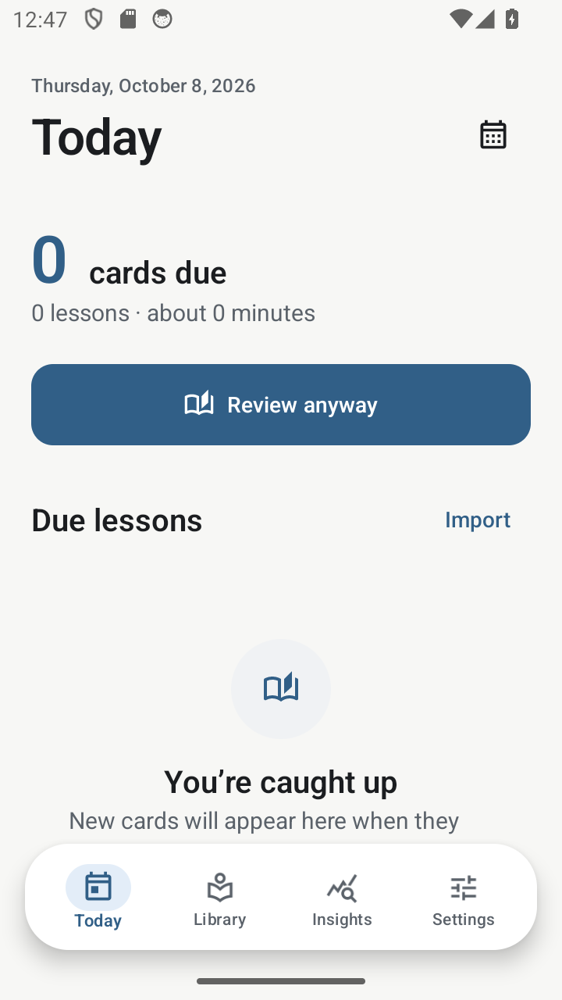

## Subjects, chapters and lessons

Two equally valid hierarchies are supported:

```text
Subject → Lesson → Cards
Subject → Chapter → Lesson → Cards
```

In Library, add a subject and choose its name and accent. Subject rows summarize
lesson and card counts. Open a subject to see direct lessons and chapter groups,
alongside totals and review/import actions. The subject's Add action offers a
lesson or a chapter. Adding inside a chapter preselects that chapter; choosing
None keeps a lesson directly under the subject.

A lesson editor accepts a title, optional summary, reusable tags and optional
chapter. Lesson details show the subject/chapter breadcrumb, tags, card and due
counts, a next-review label and a primary Review action. The three content tabs are:

- **Cards:** question/answer previews, type labels and card actions.
- **Summary:** compact context that does not need its own repeated recall card.
- **History:** last-review information and a reminder that response history is saved
  locally. This is not a full event-by-event history browser.

<p>
  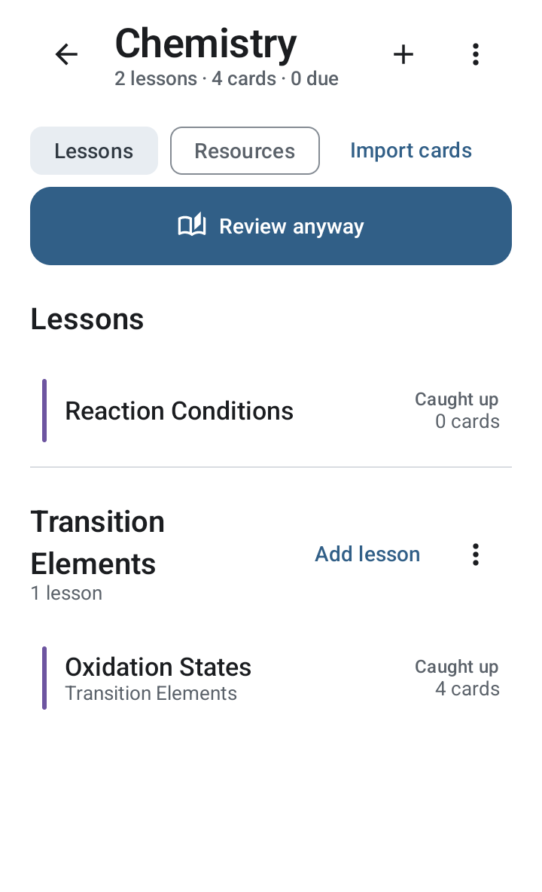
  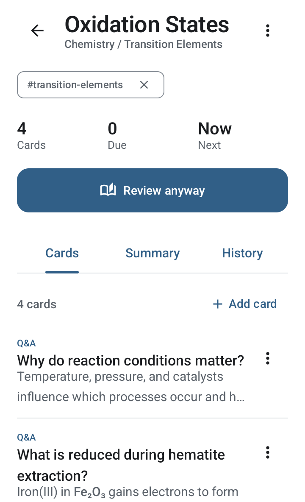
</p>

## Editing, tags and deletion

Overflow menus keep destructive and secondary actions out of the main reading
area. You can edit subjects, chapter names, lesson details and cards after creation.
Lesson tags can be entered in the editor, renamed by tapping a tag chip, or removed
from a lesson using the chip's remove control. Tags are reusable lesson labels;
there is no separate global tag-management or universal library-search screen.

Deletion behavior matters:

- **Subject:** confirmation explains that its lessons, cards, review history, notes
  and resource references are removed. Original externally attached files are kept.
- **Chapter:** confirmation explains that its lessons are kept and moved directly
  under the subject, rather than deleted.
- **Lesson:** confirmation explains that its cards and review history are deleted.
- **Card:** confirm permanent deletion, or choose Suspend as a reversible alternative.
- **Resource:** confirm removal of a note/reference; an external original is not deleted.

Make a backup before removing a major container. Deleting associated review logs
also removes those events from Insights activity.

## Subject resources

Open a subject's **Resources** tab to keep its study materials together. Create
editable text notes or attach PDFs and photos through Android's document picker.
Search resource titles/notes and filter All, Notes, PDFs or Photos. Resource details
can be edited, and notes reopened for reading and editing. Files open through an
appropriate installed Android viewer.

Attachments initially reference the selected file rather than moving the original.
Keep that source accessible on the device for offline use. Removing a reference
does not delete its original. A full ZIP backup copies the actual material contents
so they can be restored without depending on the old source location.

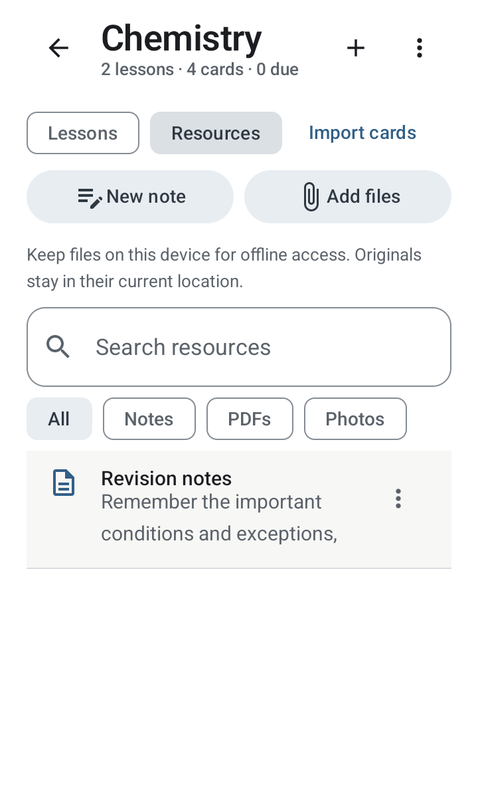

## Cards and review

Add a **Q&A** or **Cloze** card manually, with question/front, answer/back and an
optional hint. Cloze is an authored fill-in-the-blank prompt using the same reveal
workflow, not a separate automatic exercise generator. Imported cards can also
carry a source reference and pronunciation metadata.

Each lesson card row has an overflow menu for **Edit, Duplicate, Suspend/Resume
and Delete**. Suspension keeps the card but excludes it from review queues and the
review calendar. Duplication creates another card without copying its learned
memory state.

Review presents one question on a scrollable reading surface with subtle stacked
rear sheets, lesson context and progress. The rear sheets do not reveal the next
answer. Hints appear when supplied. **Show Answer** reveals the answer below the
question; long content can scroll without hiding the rating controls.

Choose **Again, Hard, Good or Easy** according to what you remembered. Each choice
shows its predicted interval, and subtle haptics accompany reveal/rating. Submitted
answers are saved before advancing. Completion summarizes answered cards, rating
counts and skipped cards separately.

**Skip for now** is available before or after revealing an answer. It moves past
the card in this session without creating a response log, changing its memory state
or moving its due date. It is not a rating, suspension or permanent dismissal.

**Previous card** revisits earlier questions in read-only session history,
including skipped cards. Swipe right to skip/next and left to go back; Arabic
reverses those directions. A one-time localized hint explains the gestures, and
buttons provide an accessible alternative. See [review navigation](review-navigation.md).

Today and subject review actions load due cards. A lesson review includes its
unsuspended cards, including “Review anyway” when nothing is due. **Rating a card
in that flow still updates its normal schedule**; there is no separate
schedule-preserving practice mode. The new-card setting limits unseen cards per
loaded session, rather than imposing a rolling daily quota.

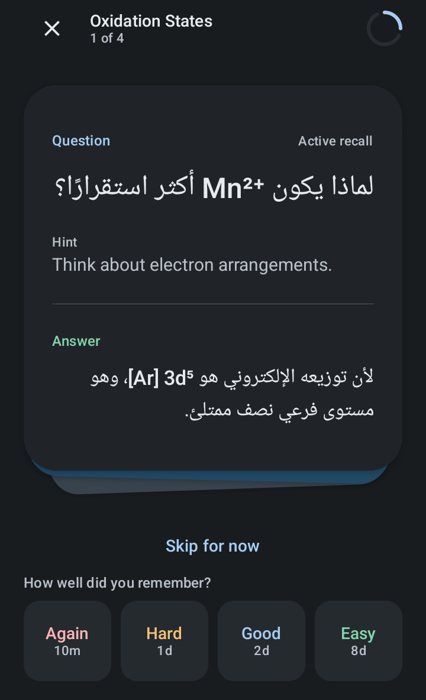

## Adaptive spaced repetition

The independent review scheduler uses FSRS-6 memory-state equations, rather than
a fixed list of review days. A response updates difficulty, stability, elapsed-time
effects, repetition/lapse information and the next due time. The default desired
retention is 90%; Settings offers 85%, 90%, 93% and 95%.

Intervals depend on card history and the chosen rating. Again uses a product-level
10-minute relearning step; the other predictions are not fixed promises. Changing
desired retention affects subsequent scheduling decisions, not every existing due
date immediately. Current default weights are not individually trained to the user.

The learning rationale is retrieval practice plus spacing. Memory predictions are
estimates, not guarantees of exam results or measured personal recall accuracy.
See [scheduler equations, persistence and research references](fsrs-scheduler.md).

## Universal AI import

Recall does not call a built-in paid AI service. Use any external AI capable of
reading your study pages and returning valid JSON:

1. Open Import from Today, Library, a subject or a lesson.
2. Copy **AI prompt** and send it with your source material to your preferred AI.
3. Paste the complete response or open its `.json` file in Recall.
4. Preview validation results; edit cards or exclude/restore them before importing.
5. Import into the selected destination. A lesson-scoped import appends to that
   lesson; a subject-scoped prompt pins the existing subject name.

The prompt prioritizes a small set of durable rules, mechanisms, conditions,
distinctions and exceptions. It rejects reworded duplicates and arbitrary static
practice exercises. Secondary context belongs in `lesson_summary`. There is **no
minimum or target count** and an **AI-side maximum of 40 high-value cards**.

The parser accepts Recall JSON v1 and v2. Its larger safety limit allows existing
imports of up to 500 cards; it does not reinterpret the prompt's 40-card generation
ceiling as a storage restriction. It validates required text, supported versions
and `qa`/`cloze` types, normalizes reusable tags, detects duplicate questions, and
reports malformed or oversized content rather than trusting AI output blindly.
Duplicate detection is not semantic AI similarity detection.

Supported v2 content includes `lesson_summary`, `content_type`, `learning_language`,
lesson/card tags, optional hints/source references and per-card
`pronunciation_targets`. Source references should identify real visible pages,
headings or figures, never invented citations. Invalid pronunciation metadata can
be omitted with warnings without discarding otherwise usable cards.

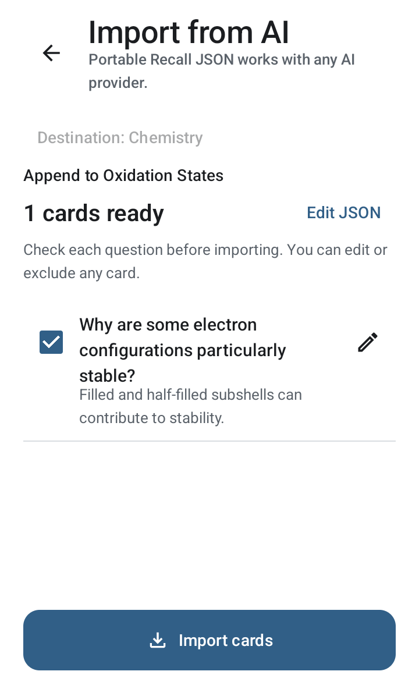

## Scientific notation and mixed-direction text

Arabic and Latin content use reusable bidirectional rendering rather than reversing
strings or forcing every paragraph into one direction. Bundled Arabic/Latin font
support, reading typography and light/dark surfaces help keep mixed content legible.

Wrap a complete expression in `[[chem:...]]` or `[[math:...]]`. The renderer hides
the markers and isolates the expression left-to-right inside surrounding prose.
Use one marker for the **whole equation**, with Unicode subscripts, superscripts,
arrows, signs, coefficients and phase labels:

```text
[[chem:Fe₂O₃(s) + 3CO(g) → 2Fe(s) + 3CO₂(g)]]
طبق [[math:V = IR]] حيث V فرق الجهد.
```

The copied AI prompt includes these rules. This is not a LaTeX typesetter or a
chemical-equation verification service; importers should still check scientific
accuracy. See [notation authoring and rendering](science-notation.md).

## Pronunciation

Language-learning lessons can specify a BCP-47 `learning_language` and exact
front/back word or phrase targets. Tap an underlined target in review, an import
preview or the card editor to hear that target, not an entire paragraph. Repeated
words use explicit one-based occurrences, and phrases stay together.

The card editor's Pronunciation section supports adding, editing and removing
targets. The AI prompt requests sparse annotations only for useful taught language,
not automatic reading of scientific symbols or code.

Playback uses installed **offline Android text-to-speech voices**, respects explicit
regional languages and leaves review scheduling untouched. A missing suitable voice
shows a message and an Android voice-management action. Settings offers Slow,
Normal and Fast speech. Recall does not bundle recordings, download voices itself,
or silently call a remote speech API. See [pronunciation schema and voice behavior](PRONUNCIATION.md).

## Review calendar

Tap the calendar icon in Today or Insights to inspect current next review dates.
Move through future months and select a day to see its card count, Q&A/Cloze split,
new-card count and overdue count where applicable. Cards are grouped by lesson,
with type/state/time metadata. Tap a card for a read-only question/answer preview,
including its hint/source when available, or open its lesson.

Overdue cards are collected under **Today**, not abandoned on past dates. Suspended
cards and archived containers are excluded. Day details load in batches of 100,
with Load more for larger queues.

This calendar is a projection of **each card's current next due time**, not a
forecast of every future repetition. Rating a card changes its next date. Past
activity belongs in Insights, not this calendar. Local start-of-day boundaries
handle timezone and daylight-saving changes; the grid remains chronological in RTL.

<p>
  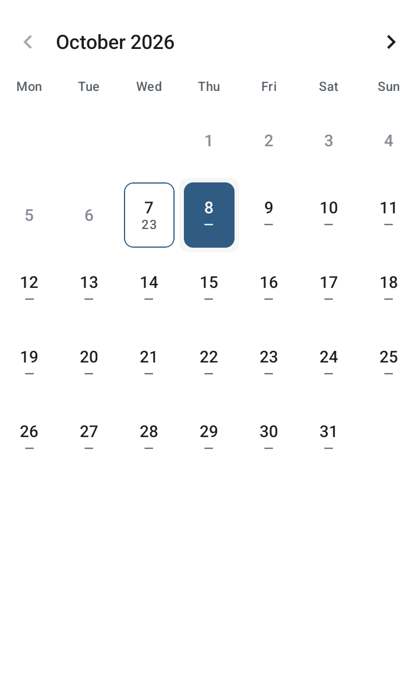
  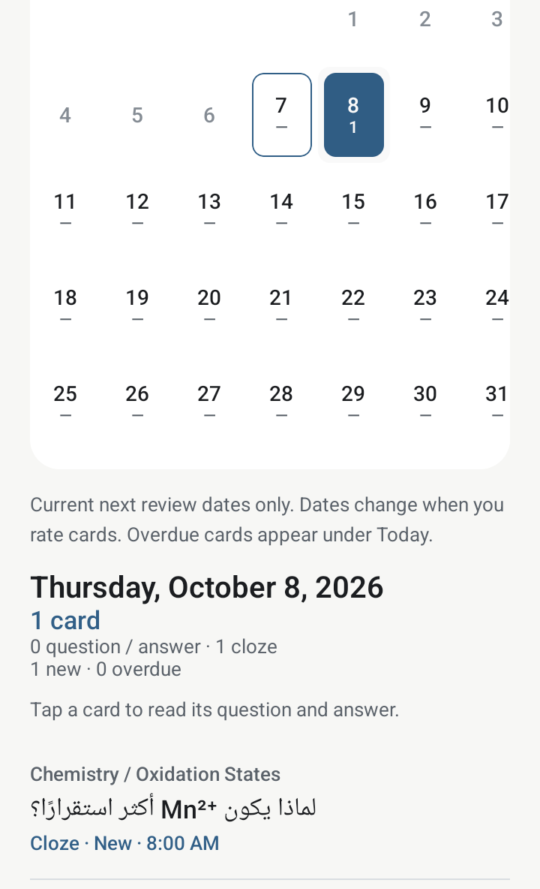
</p>

## Insights and study activity

Insights summarizes today's completed responses and a rough study-time estimate.
The Review target tile shows the configured scheduling target. Observed recall
reports self-reported success in eligible delayed, due review events over 30 days,
with event and distinct-card counts; percentages require 30 events across 10 cards.
It does not represent the remembered percentage of the library.

Active cards are grouped exclusively into New, Learning and Mature — estimated.
Mature requires review state and at least 21 days of finite FSRS stability; this
estimates a memory horizon, not comprehension or mastery. Optional attention rows
show evidence of repeated delayed recall failures, open the relevant lesson and
never add obligations or reschedule cards. Legacy records without reliable audit
fields are excluded conservatively. An optional expandable current predicted recall
estimate averages eligible active review-state cards using the existing FSRS curve
and UTC-day convention, with coverage and small-group/empty explanations. It is
not comprehension and is not compared with observed events as calibration.
See [exact definitions and limitations](learning-insights.md) and the
[deferred historical/calibration options](learning-insights-phase2-proposal.md).

**Study activity** is a contribution-style calendar from real completed response
logs, displayed immediately beneath the Insights header. Arabic interface typography
uses bundled Cairo weights offline; mathematical and chemical expressions retain
their dedicated LTR rendering.
Merely opening a card, skipping it, or having cards scheduled/due does not
create activity. Multiple submitted responses to the same card count separately.

- Approximately 16 recent weeks are visible initially; scroll back through a rolling year.
- Week rows and month labels use the locale; the timeline stays chronological in RTL.
- Tap a day, including an empty day, for its full date and exact completed-response count.
- Future cells are blank/non-interactive. Empty history still shows the calendar structure.
- Fixed color levels are 0, 1–5, 6–15, 16–30 and 31+ responses, with a Less–More legend.

Aggregation uses the current device timezone and historical DST offsets. Original
event timezones are not stored, so changing the device timezone can move an event
to a neighboring calendar day. Deleting a card's history removes its activity too.
No extra activity database, analytics SDK or fabricated runtime history is used.
See [data flow and heatmap tests](study-activity.md).

<p>
  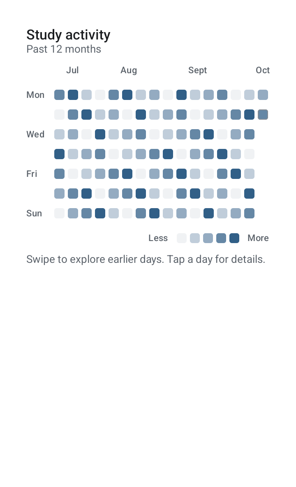
  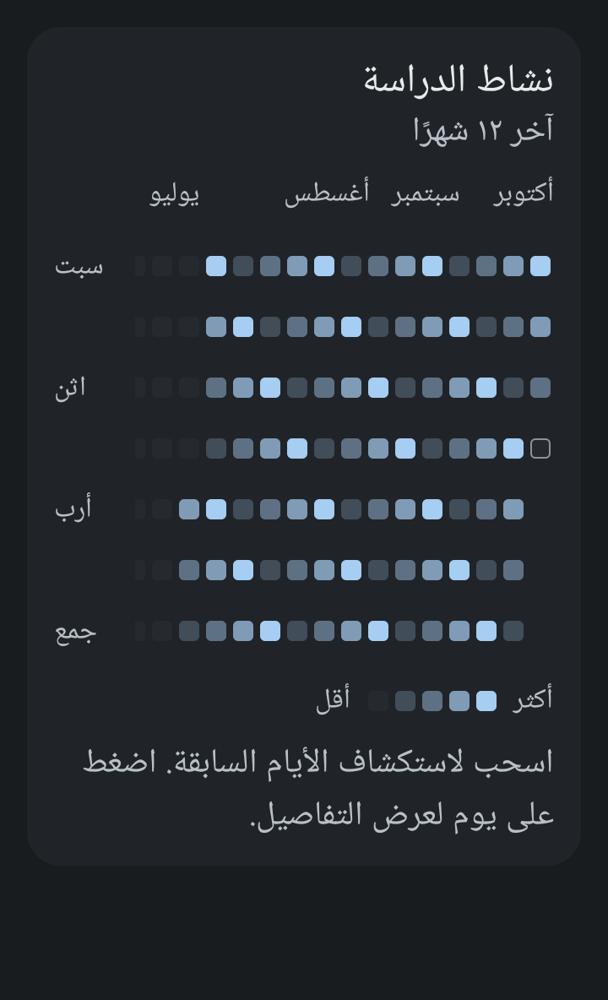
</p>

## Schedules and reminders

Settings → Study schedule supports named, recurring weekday ranges. Add or edit
a **Quiet Time** or **Study Window**, including overnight ranges such as sleep
from 23:00 to 07:00. Quiet times always win when ranges overlap. Study windows
guide reminder delivery; they never prevent opening the app or studying elsewhere.

Enable Review reminders in Settings to request Android notification permission in
context. Reminders aggregate currently due cards, defer through quiet periods and
prefer an available study window within 24 hours; otherwise they seek an allowed
daytime. Normal reminders are limited to one per local day. An optional
study-window-start reminder has its own cooldown.

**Pause reminders** temporarily pauses delivery, not review due dates. The pause
sheet offers Resume now, 1/2/4 hours, evening/tomorrow choices and a custom 1–72-hour
duration. Notification actions
can open review or pause delivery for two hours. Background settings show notification
access/battery restrictions and links to Android settings.

A persistent WorkManager safety check is registered at a 15-minute interval;
relevant changes also request coalesced checks. **Android decides when background
work runs**. Doze, battery optimization, manufacturer sleeping-app policies and
force-stop can delay or prevent delivery. There is no exact-alarm or always-running
foreground-service guarantee. Reopen after force-stop and review battery settings
on restrictive devices.

Tap Scheduler information **six times** (the dialog title also counts) to enable
persisted debug mode. It reveals a **Test notification** action and execution,
decision and deferral diagnostics. The test uses the real channel but bypasses due
counts/pauses and does not change the normal reminder cooldown. It verifies posting,
not guaranteed background timing. See [reminder policy and troubleshooting](reminders-and-full-backups.md).

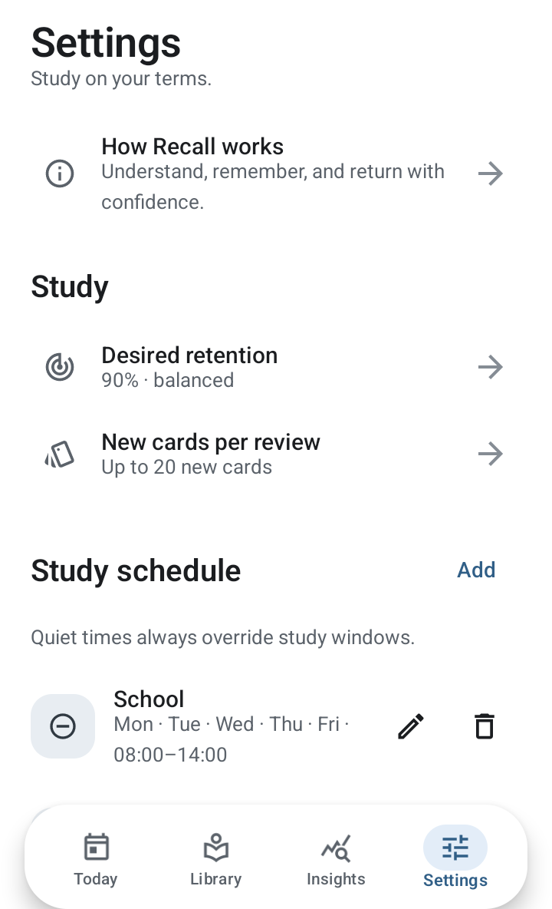

## Settings and the first-launch guide

Settings centralizes retention and per-review new-card preferences, schedules,
reminders/pauses, background diagnostics, appearance, interface language, offline
voice controls, backups and scheduler information.

Choose **System, Light or Dark** appearance; optional dynamic color uses the device
palette on Android 12+. Choose **System, English, العربية, Español, Français or Deutsch**.
All five interface translations are bundled for offline use, covering navigation,
lesson/card editors, imports and validation, insights, calendars, settings, schedules,
backup status, pronunciation messages, onboarding and reminder notifications/actions.
Dates, times, counts and plural forms use the selected locale. System follows a
supported device language, otherwise falling back to English. Device region is
retained for regional date/week conventions. Arabic mirrors appropriate navigation;
calendar timelines and scientific expressions retain chronological/LTR ordering.
Language changes take effect immediately and persist across restarts and backups.
Your subjects, lessons, cards, tags and attached material names are never translated.
The AI prompt/JSON keys remain English protocol text; generated study content retains
the source language. Offline pronunciation still uses each lesson/target language,
not the interface language. Android's external settings and file picker follow the OS.

**How Recall works** explains the lesson-first workflow, memory mechanism,
retrieval/spacing rationale, scientific references, practical limitations and the
latest changes. It appears once on first entry and can be reopened from Settings.

<p>
  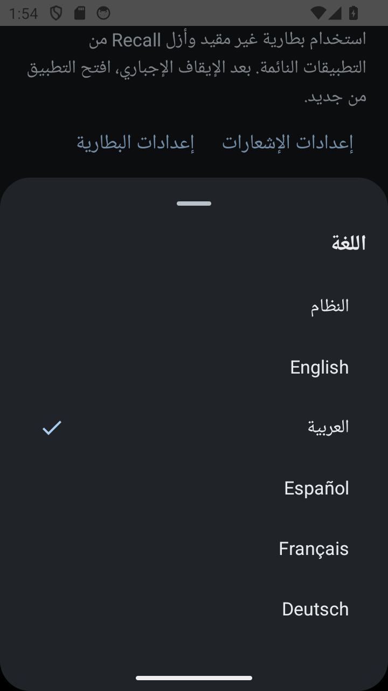
  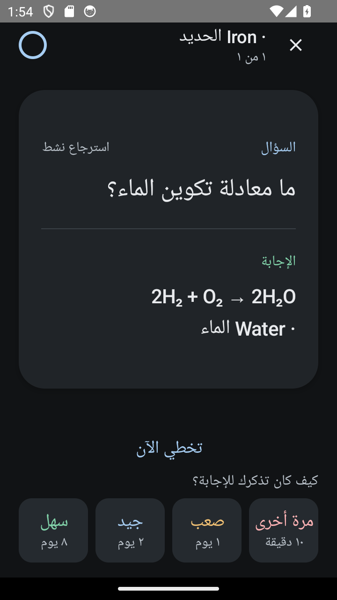
  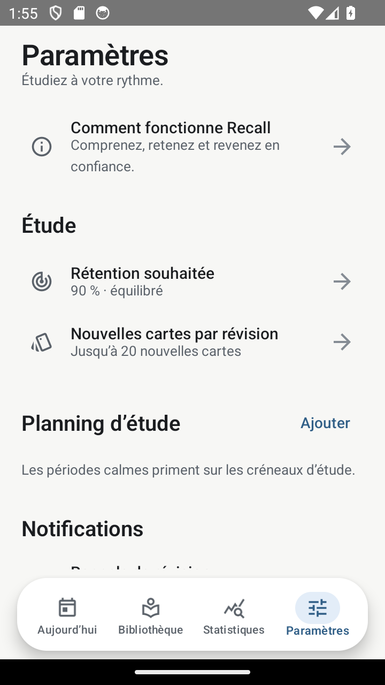
</p>

## Backups and data ownership

Use Settings → **Export all data** for a portable, **unencrypted ZIP** containing
study records, review state/history, tags, schedules, relevant settings,
pronunciation metadata, notes and actual attached PDF/photo contents. Keep it private
and ensure sufficient free storage. Inaccessible source attachments cause an error,
not a silently incomplete archive.

**Restore full backup** validates archive paths, size limits, versioned data and
attachment SHA-256 checksums before merging. Existing record IDs are kept rather
than overwritten; settings are restored after confirmation. Material contents are
copied into private app storage, so the old original files need not remain available.

**Export data only / Import backup** retains the older JSON workflow. It does
**not** include attachment bytes and should not be mistaken for a complete portable
material backup. JSON imports and full backup restore are separate from AI card import.
See [archive format, limits and restore behavior](reminders-and-full-backups.md).

## Reliability, performance and current boundaries

Room stores structured study data with non-destructive migrations. DataStore stores
preferences. Review state and its log commit atomically; stale/duplicate submissions
are rejected before the interface advances. Finished responses survive closing the
app. Ordinary Activity recreation retains the in-memory session, but process death
returns safely to Today rather than restoring an unfinished queue.

The latest source moves import parsing and backup IO away from the UI thread,
bounds imported text before allocation, queries subject queues in SQL, avoids
unnecessary hidden-screen work, caches text annotations and preserves main-tab
scroll positions. Short dock/route/reveal transitions remain; long outgoing review
content is no longer retained during a card transition. The optimized `preview`
build uses R8/resource shrinking for everyday testing.

Core features are offline. External AI, externally hosted source links, Android
voice installation and externally hosted files can have their own connectivity
requirements. There is no cloud sync, account system, built-in AI API, automatic
semantic deduplication, full-library search, persistent unfinished-session restore,
or personalized FSRS training in this version. Documentation is not a guarantee
that every device-specific issue has been reproduced or that notifications bypass
Android restrictions.

See [latest changes and verification](CHANGELOG.md), [build instructions](../README.md#build)
and [third-party notices](../THIRD_PARTY_NOTICES.md).
